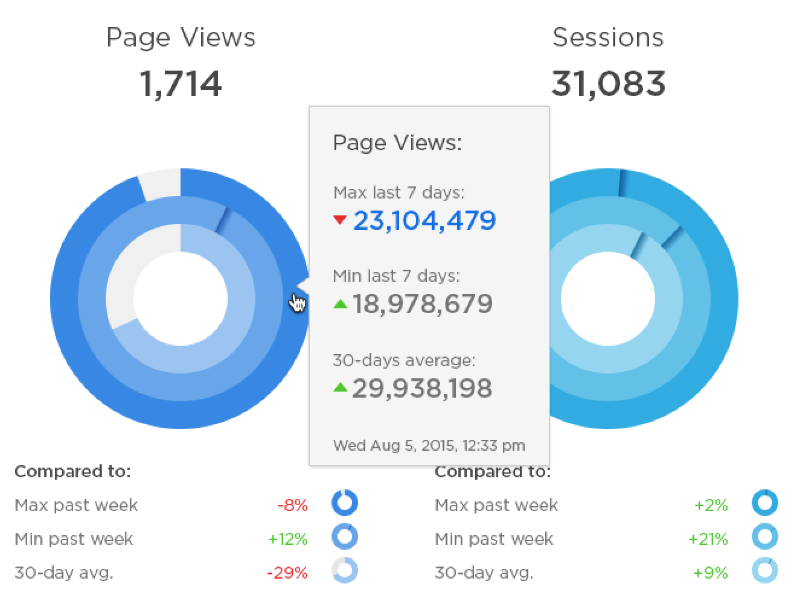
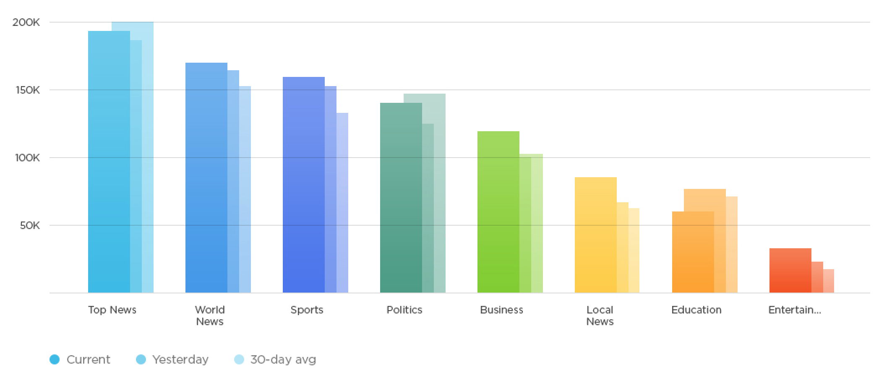
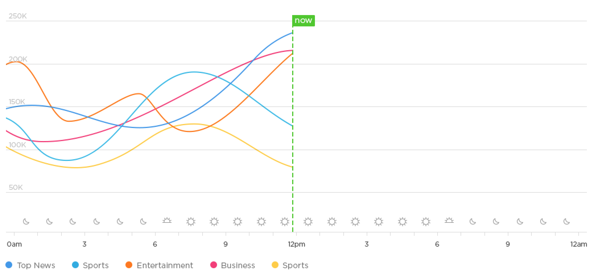
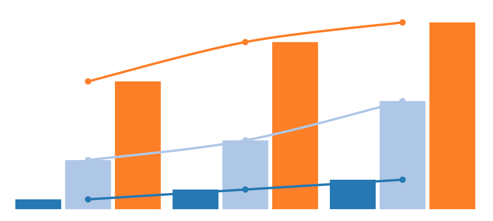

#  rumble-charts

[](https://github.com/rumble-charts/rumble-charts/actions/workflows/node.js.yml)
[](https://github.com/rumble-charts/rumble-charts/actions/workflows/codeql-analysis.yml)
[](https://codecov.io/gh/rumble-charts/rumble-charts)

[](https://sonarcloud.io/dashboard?id=rumble-charts_rumble-charts)
[](https://sonarcloud.io/dashboard?id=rumble-charts_rumble-charts)
[](https://sonarcloud.io/dashboard?id=rumble-charts_rumble-charts)
[](https://sonarcloud.io/dashboard?id=rumble-charts_rumble-charts)
[](https://sonarcloud.io/dashboard?id=rumble-charts_rumble-charts)

[](https://www.npmjs.com/package/rumble-charts)
[](https://www.npmjs.com/package/rumble-charts)
[](https://bundlephobia.com/package/rumble-charts@latest)
[](https://bundlephobia.com/package/rumble-charts@latest)

React components for building composable and flexible charts to visualize your data.

It's based on D3.js under the hood, but most of the time you will not feel that.

## Real-world examples







## Documentation

All examples are live editable on "Playroom" tab.

[https://rumble-charts.github.io](https://rumble-charts.github.io)

## Demo / live edit

[https://rumble-charts.github.io/playroom/](https://rumble-charts.github.io/playroom/)

## Installation

### NPM

```bash
npm install --save rumble-charts
```

### CDN

```html

<script src='https://unpkg.com/rumble-charts/umd/rumble-charts.min.js'></script>
```

## Usage

Just include it:

```javascript
import {
  // main component
  Chart,
  // graphs
  Bars, Cloud, Dots, Labels, Lines, Pies, RadialLines, Ticks, Title,
  // wrappers
  Layer, Animate, Transform, Handlers,
  // helpers
  helpers, DropShadow, Gradient
} from 'rumble-charts';
```

And use:

```jsx
const series = [{
  data: [1, 2, 3]
}, {
  data: [5, 7, 11]
}, {
  data: [13, 17, 19]
}];

<Chart width={600} height={250} series={series} minY={0} maxY={20}>
  <Bars innerPadding={5} groupPadding={10} />
  <Lines />
  <Dots />
</Chart>;
```

Result:



## [Changelog](CHANGELOG.md)

## [Road map](ROADMAP.md)

## License

MIT
